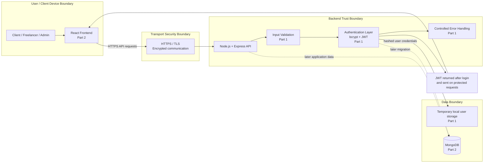

# HustleHub+ Architecture Diagram

> This diagram represents the overall MERN architecture required by the PoE.
> Part 1 implements the secure Node.js/Express backend foundation. React and
> MongoDB are shown because they form part of the final MERN system and are
> introduced in later parts of the PoE.

## Security boundaries shown

- **User/client boundary:** users interact with the platform through the React
  frontend in the final MERN architecture.
- **Transport boundary:** communication between the client and API crosses an
  HTTPS/TLS boundary so request and response data are encrypted in transit.
- **Backend trust boundary:** Node.js and Express handle API requests. Validation,
  authentication and controlled error handling are placed inside this boundary.
- **Data boundary:** Part 1 may use temporary local storage. MongoDB is included
  in the architecture because the final application must use the MERN stack.
- **Credential protection:** passwords are designed to be hashed with bcrypt
  before storage. JWT is designed to identify authenticated users on later
  protected requests.
